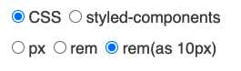
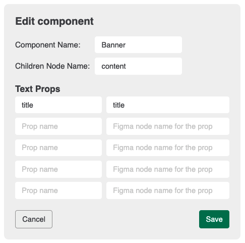
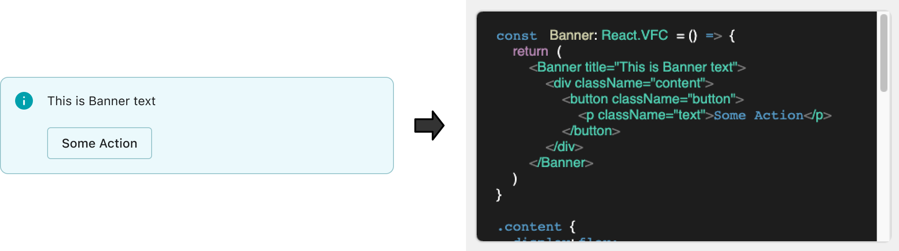

[](https://github.com/kazuyaseki/figma-to-react/actions/workflows/ci.yml)
[](https://github.com/kazuyaseki/figma-to-react/graphs/commit-activity)
[](https://github.com/kazuyaseki/figma-to-react/pulls)
[](https://twitter.com/intent/tweet?text=Figma%20to%20React%20is%20awesome%20https://github.com/kazuyaseki/figma-to-react/)

<p align="center"></p>
  
<h1 align="center">Figma to React Component</h1>

<div align="center">
<a href="https://www.figma.com/community/plugin/959795830541939498/Figma-to-React-Component" align="center"></a>
</div>

<br />

https://user-images.githubusercontent.com/6080698/116072313-de1cd180-a6c9-11eb-8e32-fe9a2f9a79f8.mov

## The Problem

Many Figma to Code tools have one or more problems of the follwings:

- generates for whole Figma file(not by component)
- need to go outside of Figma to visit service's site
- layout style is not responsive, and is absolute positioned to its parent

## Solution

Figma to React Component outputs React code in the plugin UI and can be genrated by selecting certain node.
And its style is derived from Auto Layout properties, thus is responsive.


## Futrther features

### Change CSS format and size

You may choose either Pure CSS or styled-components, and you may also change size for px and rem.



### Component setting

You may add component setting.
When you add component setting including component name, name of children node(optional), and props(optional), the plugin will render matched node as component.





## Development

```sh
npm install
npm run dev
```

## For Those of you Who would like to create your own Figma to xxx

Feel free to folk this repositoty, create and publish your own Figma to Vue, Flutter, SwiftUI or whatsoever!

`buildTagTree` method would be useful for such case.
`buildTagTree` metssod outputs a `tag` object in the following format which is independent from how the final outcome is structured.

```ts
export type Tag = {
  name: string
  isText: boolean
  textCharacters: string | null
  isImg: boolean
  properties: Property[]
  css: CSSData
  children: Tag[]
}
```
